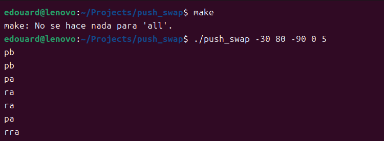

# push_swap (42 School Project)

The "push_swap" project at 42 School challenges students to implement a sorting algorithm using two stacks. The goal is to sort a list of integers with the fewest operations while following strict constraints. It tests algorithm optimization, data structure manipulation, and handling edge cases.

- **Subject:** [English](./subject/en.subject.pdf) / [French](./subject/fr.subject.pdf) / [Spanish](./subject/es.subject.pdf)
- **Location:** 42 School Barcelona
- **Validation:** December 2024


## Usage

### Setup for 42

1. Clone the repo locally
2. Rename `..gitignore` to `.gitignore`
3. Push to your own repo to ensure only required files are included.

### Simple Usage



```
make           # Compile the program
./push_swap -30 80 -90 0 50  # Displays move list to sort the integers
```

### Makefile Commands

```
make           # Compile the program
clean          # Remove .o files
fclean         # Remove .o files and the binary
re             # Clean, then recompile the program
```

## Tools

### Integer Generator


The `test` folder contains a random integer generator:

- Usage: `./test/generator <list_size> [range]`
- Example:
    ```
    ./test/generator 100 2000  # Generates 100 integers in range [-2000, 2000]
    ./test/generator 500       # Generates 500 integers in range [INT_MIN, INT_MAX]
    ```
- Source: `test/generator.c`

### Sorted List Checker


Checks if the list is sorted after applying the program's moves:

- Displays "OK" if the list is sorted
- Displays "KO" if the list is not sorted
- Usage:
    ```
    ARGS="-30 80 -90 0 50"; ./push_swap $ARGS | ./test/checker_linux $ARGS  # Manually typed numbers
    ARGS="$(./test/generator 500)"; ./push_swap $ARGS | ./test/checker_linux $ARGS  # Using the generator
    ```

### Automated Tester


The `test` folder contains a script to run multiple tests:

1. Runs the program `n` times on 500 random numbers (new numbers each time)
2. Displays the number of moves and checker output for each test
3. Shows how many tests returned "KO" and how many took more than 5500 moves

- Usage: `./test/test.sh <num_tests>`
- Example:
    ```
	cd test
    ./test.sh 100  # Run the test 100 times
    ```

### Test with Manual Input


To display the list of moves:

```
./push_swap -30 80 -90 0 50    # Manually entered numbers
./push_swap "-30 80 -90 0 50"  # String of space-separated numbers
./push_swap "$(./test/generator 500)"  # Using the generator
```

### Visual Tests


Run tests with more visual output:

```
cd test                      # Navigate to the 'test' folder
make                         # Displays moves, move count, and checker result
make ARGS="-30 80 -90 0 50"   # For manually entered numbers
make ARGS="$(./test/generator 500)"  # For generated numbers

make valgrind                 # Run valgrind to check for memory leaks
make moves                    # Display only the list of moves
make count                    # Display only the move count
make check                    # Display only the checker output

# Combine rules, e.g., `make moves check`
```

For `make valgrind` to work, you need [valgrind](https://valgrind.org/) installed:
```
sudo apt update && sudo apt install valgrind
```

### Debugging


Replace file `moves_def.c` by this one `test/moves_def.c`, compile the program and run it.
```bash
cd test
mv moves_def.c ../moves_def.c
make ARGS="$(./generator 20 1000)"
```


